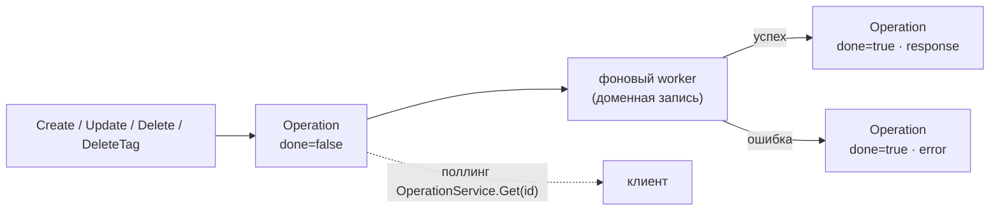

import { ApiOperation } from '@site/src/components/commonBlocks/ApiOperation'
import CodeBlock from '@theme/CodeBlock'
import dedent from 'ts-dedent'

# Операции (Long-Running Operations)

Мутации Kachō Registry **асинхронны**: `Create` / `Update` / `Delete` реестра, `DeleteTag` и
admin-`TriggerGarbageCollection` не возвращают ресурс сразу, а отдают **`Operation`** (LRO). Это
решает задачу «мутация может занять время» единообразно: клиент получает id операции немедленно и
опрашивает её статус, пока фоновая запись не завершится. Watch-RPC не существует — только поллинг.

Операции реестра несут идентификатор с префиксом **`rop`** и хранятся в общей таблице `operations`
(из `kacho-corelib/operations`). Фоновый worker выполняет доменную запись и финализирует строку
операции.

## Форма Operation

<table>
  <thead><tr><th>Поле</th><th>Тип</th><th>Описание</th></tr></thead>
  <tbody>
    <tr><td><code>id</code></td><td>string</td><td>Идентификатор операции (префикс <code>rop</code>)</td></tr>
    <tr><td><code>description</code></td><td>string</td><td>Человекочитаемое описание операции</td></tr>
    <tr><td><code>createdAt</code></td><td>timestamp</td><td>Момент создания операции</td></tr>
    <tr><td><code>done</code></td><td>bool</td><td><code>false</code> — в процессе; <code>true</code> — завершена (успех или ошибка)</td></tr>
    <tr><td><code>metadata</code></td><td>Any</td><td>Метаданные операции (напр. <code>&#123; "registryId": "reg…" &#125;</code>) — доступны сразу</td></tr>
    <tr><td><code>response</code></td><td>Any</td><td>Результат при успехе (напр. <code>Registry</code>, либо пусто для Delete/DeleteTag)</td></tr>
    <tr><td><code>error</code></td><td>google.rpc.Status</td><td>Ошибка при неуспехе (<code>oneof</code> с <code>response</code>)</td></tr>
  </tbody>
</table>

`response` и `error` — взаимоисключающие (`oneof result`): при `done=true` заполнено ровно одно.

## Жизненный цикл

## Методы

### Get — получить операцию

<ApiOperation method="GET" endpoint="/registry/v1/operations/{operationId}">

Возвращает текущее состояние операции (`done` / `response` / `error`). Клиент поллит этот метод до
`done=true`. Доступен на **обоих** control-plane-listener'ах.

<CodeBlock language="bash">
  {dedent`
    curl 'http://localhost:18080/registry/v1/operations/rop7h9x2k4m8p0q1r5' \\
      -H 'Authorization: Bearer <JWT>'
  `}
</CodeBlock>

<CodeBlock language="json">
  {dedent`
    {
      "id": "rop7h9x2k4m8p0q1r5",
      "description": "create registry team-images",
      "done": true,
      "metadata": { "registryId": "reg7h9x2k4m8p0q1r5" },
      "response": {
        "id": "reg7h9x2k4m8p0q1r5",
        "projectId": "prj-demo",
        "name": "team-images",
        "status": "REGISTRY_STATUS_ACTIVE"
      }
    }
  `}
</CodeBlock>

</ApiOperation>

:::note Авторизация операций — ownership-scoped
`OperationService.Get` не проходит стандартный per-RPC object-Check (id операции opaque). Вместо этого
операция матчится по **principal'у создателя**: вернуть/увидеть её может только тот, кто её создал.
Чужой principal → `NOT_FOUND` (no-leak) — так закрыт доступ к чужой операции по её id.
:::

### ListOperations — история операций реестра

История операций конкретного реестра доступна через `RegistryService.ListOperations`
(`GET /registry/v1/registries/{registryId}/operations`) — фильтр по `registryId`, cursor-пагинация,
Check `v_list` на `registry_registry`. Описание — на странице [Registry](/api/registry#listoperations--история-операций-реестра).

## Ошибки

<table>
  <thead><tr><th>Ситуация</th><th>Код</th><th>Поведение</th></tr></thead>
  <tbody>
    <tr><td>Пустой <code>operationId</code></td><td><code>INVALID_ARGUMENT</code></td><td><code>"operation_id required"</code></td></tr>
    <tr><td>Операция не найдена</td><td><code>NOT_FOUND</code></td><td><code>"operation &lt;id&gt; not found"</code></td></tr>
    <tr><td>Операция чужого principal'а</td><td><code>NOT_FOUND</code></td><td>Ownership-scoped: чужая операция скрыта (no-leak)</td></tr>
  </tbody>
</table>

:::tip Ошибка внутри операции ≠ ошибка Get
Если сама мутация провалилась, `OperationService.Get` вернёт `200` с `done=true` и заполненным полем
`error` (`google.rpc.Status`) — **не** gRPC-ошибку на самом `Get`. Проверяйте `error` в теле готовой
операции.
:::
