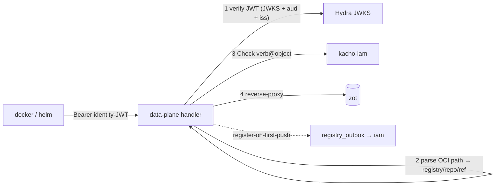
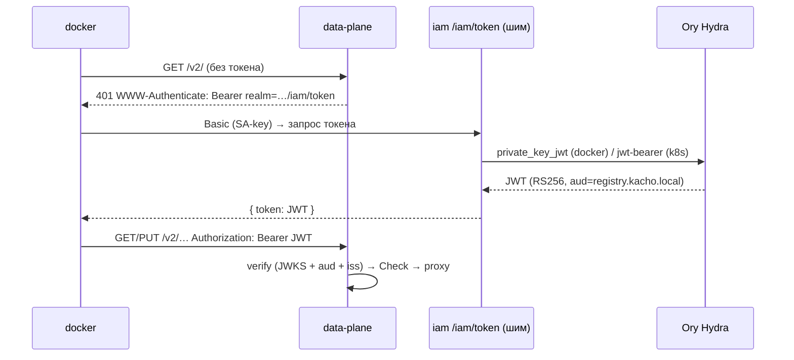

import CodeBlock from '@theme/CodeBlock'
import dedent from 'ts-dedent'

# Data-plane — OCI push/pull

Data-plane — это поверхность, с которой работает `docker` и `helm`. Она реализует **Docker Registry v2
/ OCI Distribution** на host `registry.kacho.local` и решает задачу «дать привычный push/pull, но с
авторизацией по правам платформы». Внутри это **тонкий auth-proxy**: он аутентифицирует клиента по
identity-JWT, авторизует каждый запрос через IAM и проксирует его в бэкенд хранилища (zot).

Data-plane — отдельный HTTP-листенер (не gRPC), поднимается на своём адресе (`KACHO_REGISTRY_DATAPLANE_ADDR`,
дефолт `:8080`) за внешней TLS-терминацией (ingress). Если адрес пуст — data-plane не поднимается
(control-plane при этом работает).

## Поток запроса

1. **AuthN** — `Authorization: Bearer <JWT>` верифицируется по JWKS Ory Hydra (подпись RS256/ES256),
   с проверкой audience (`registry.kacho.local`) и issuer (pinned в production). Токен без нужного
   `aud` отвергается (federation-out на другие RP доступа не даёт).
2. **Парсинг пути** — OCI-путь `/v2/<registry>/<repo>/...` разбирается в `(registryId, repo, ref)`.
   Сегментация — до url-decode (split-then-decode), с отбраковкой path-traversal (`..`, encoded-slash)
   `400` ещё до обращения к zot. `registryId` обязан нести префикс `reg` — иначе `404`.
3. **AuthZ** — per-request Check verb@object в IAM (см. verb-map ниже).
4. **Проксирование** — запрос как есть форвардится в zot (namespace адресуется storage-path-префиксом
   `<registryId>/<repo>`).

## Токен-обмен (docker login)

Docker сам получает Bearer-токен по протоколу Registry token-auth: при `401` с заголовком
`WWW-Authenticate: Bearer realm="…/iam/token",service="registry.kacho.local"` он идёт в realm за
токеном. Realm указывает на **token-шим kacho-iam** (`/iam/token`), который брокерит настоящий токен у
Ory Hydra (федерация — Variant H).

<table>
  <thead><tr><th>Клиент</th><th>Grant у Hydra</th><th>Как логинится</th></tr></thead>
  <tbody>
    <tr><td><code>docker</code> / <code>helm</code> (CI)</td><td><code>client_credentials</code> (<code>private_key_jwt</code> шим)</td><td><code>docker login</code> учётными данными SA-key</td></tr>
    <tr><td>Kubernetes workload</td><td><code>jwt-bearer</code> (projected token)</td><td>FEDERATED SA-key (trusted_subjects, без приватного ключа)</td></tr>
  </tbody>
</table>

Отзыв SA-key немедленно закрывает последующий обмен (docker и k8s) — токен больше не выдаётся.

## Verb-map push/pull

Каждый OCI-запрос отображается в verb-relation на объекте авторизации. Ключевое различие — push в
**новый** vs **существующий** репозиторий:

<table>
  <thead><tr><th>Действие</th><th>OCI</th><th>verb @ object</th></tr></thead>
  <tbody>
    <tr><td>pull (blob/manifest GET)</td><td>GET <code>/v2/&lt;reg&gt;/&lt;repo&gt;/…</code></td><td><code>v_get</code> @ <code>registry_repository</code></td></tr>
    <tr><td>push в существующий repo</td><td>PUT / POST</td><td><code>v_update</code> @ <code>registry_repository</code></td></tr>
    <tr><td>push в <strong>новый</strong> repo</td><td>PUT manifest / blob-upload</td><td><code>v_create</code> @ <code>registry_registry</code> (право создать repo в namespace)</td></tr>
    <tr><td>cross-repo mount (dst)</td><td>POST <code>?mount=…&from=…</code></td><td>dst-verb зеркалит push; src-repo проверяется на доступ (exfil-guard)</td></tr>
  </tbody>
</table>

:::note Register-on-first-push
При первом успешном manifest-PUT нового репозитория data-plane эмитит intent регистрации его
authz-объекта `registry_repository` (parent — реестр) в `registry_outbox` — так репозиторий становится
адресуемым per-repo authz и видимым в control-plane `ListRepositories`. Это post-response side-effect:
если единичный emit-в-outbox не удался, клиент сохраняет свой 2xx (push уже успешен). Register
идемпотентен (advisory-lock + dedup в iam), а недостигнутая регистрация само-восстанавливается на
следующем push.
:::

## Exfil-guard (cross-repo mount)

OCI позволяет «примонтировать» блоб из другого репозитория (`POST …/blobs/uploads?mount=<digest>&from=<src>`)
без перезаливки. Data-plane не даёт так вытащить чужой блоб: помимо verb на dst-репозитории проверяется
доступ к **src**-репозиторию. Нет доступа к source — mount не проходит (иначе — обход авторизации на
чтение чужого содержимого).

## Existence-hiding и fail-closed

- **Existence-hiding.** Аутентифицированный, но не авторизованный запрос получает `NOT_FOUND`
  (`404 NAME_UNKNOWN`), а не `403` — сервис не подтверждает существование чужого реестра/репозитория.
- **Fail-closed.** Недоступность IAM (Check) или zot на request-path — отказ (не «пропустить»), для
  мутаций — retriable ошибка, а не деструктивное действие. В production data-plane отказывается
  стартовать без https-JWKS, pinned issuer и подтверждённой внешней TLS-терминации (bearer-токены не
  должны транзитить открытым текстом).

:::warning Удаление образов — только control-plane
Data-plane `DELETE` манифеста отвергается `405`. Единственный destructive-путь для образов —
control-plane [DeleteTag](/api/tag), чтобы удаление проходило authz-проверку `v_delete` и корректно
снимало repo-tuple при опустошении репозитория.
:::
