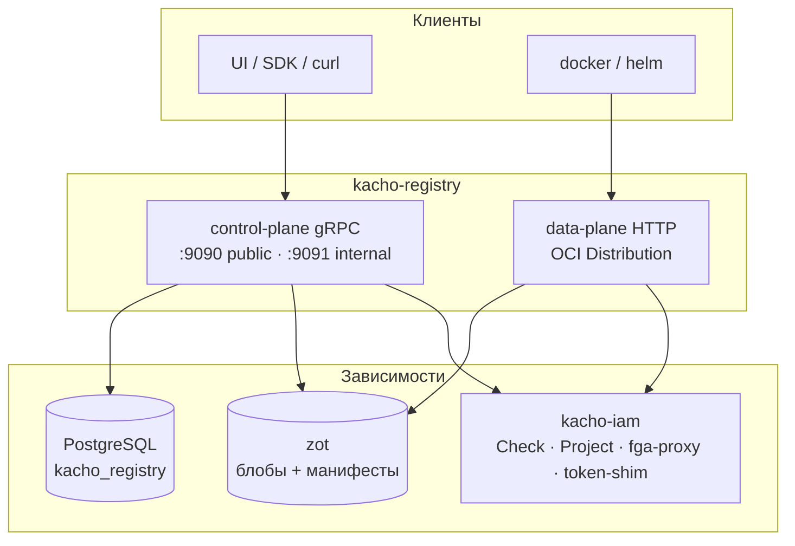
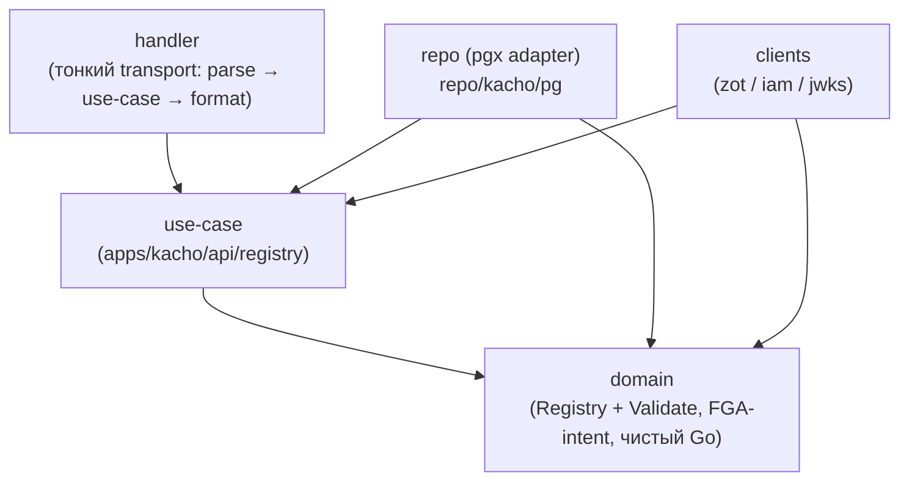
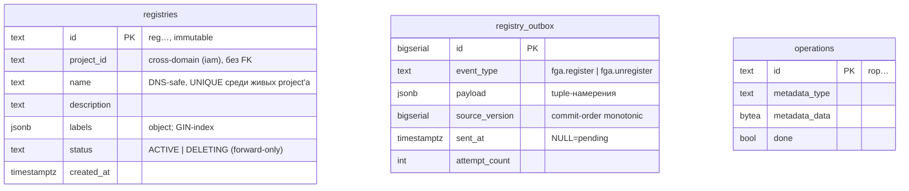
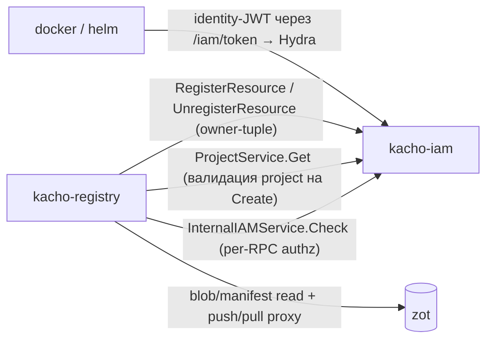

import CodeBlock from '@theme/CodeBlock'
import dedent from 'ts-dedent'

# Архитектура

Эта страница описывает внутреннее устройство Kachō Registry: слоистую (clean) архитектуру, две
плоскости (control-plane и data-plane), схему БД (database-per-service), связку с хранилищем образов
(zot) и место сервиса в платформе. Внешний контракт — на [страницах API](/api/overview); детали
push/pull — [Data-plane](/architecture/data-plane); модель прав — [Авторизация](/architecture/authz).

## Две плоскости

Registry — это **control-plane** (управление namespace и просмотр содержимого) поверх **data-plane**
(стандартный OCI push/pull). Обе работают с одним namespace, но по разным протоколам и с разной
аудиторией.

- **Control-plane** управляет ресурсом Registry (CRUD в БД) и читает проекции Repository/Tag из zot.
- **Data-plane** — reverse-proxy OCI-запросов в zot с authN (identity-JWT) + authz (per-request Check).

## Чистая архитектура (control-plane)

Control-plane следует строгому правилу зависимостей: транспорт зависит от бизнес-логики, бизнес-логика
— от домена, домен не зависит ни от чего, кроме stdlib и контракта `kacho-proto`.

<table>
  <thead><tr><th>Слой</th><th>Где</th><th>Ответственность</th></tr></thead>
  <tbody>
    <tr><td><strong>domain</strong></td><td><code>internal/domain/</code></td><td>Сущность Registry + <code>Validate()</code>, классификация артефакта, FGA-intent (object-type/verb/subject). Только stdlib + proto</td></tr>
    <tr><td><strong>use-case</strong></td><td><code>internal/apps/kacho/api/registry/</code></td><td>Бизнес-логика CRUD + LRO-worker; определяет порты Repo / ZotClient / IAMClient</td></tr>
    <tr><td><strong>repo (adapter)</strong></td><td><code>internal/repo/kacho/pg/</code></td><td>handwritten pgx; SQLSTATE → sentinel; owner-tuple outbox-emit в TX</td></tr>
    <tr><td><strong>clients (adapter)</strong></td><td><code>internal/clients/&#123;zot,iam,jwks&#125;/</code></td><td>zot HTTP/GraphQL, iam gRPC (Check/Project/register), JWKS-верификатор</td></tr>
    <tr><td><strong>handler</strong></td><td><code>internal/handler/</code></td><td>Тонкий transport + scope-filtered listauthz (row-filter, existence-hiding)</td></tr>
    <tr><td><strong>data-plane</strong></td><td><code>internal/dataplane/</code></td><td>OCI auth-proxy: parse path → verify JWT → Check → forward в zot</td></tr>
    <tr><td><strong>check (authz)</strong></td><td><code>internal/check/</code></td><td>Authz-интерсептор + permission-map (verb-relations на registry_registry / registry_repository)</td></tr>
    <tr><td><strong>composition root</strong></td><td><code>cmd/kacho-registry/</code></td><td>Единственное место wiring; <code>cmd/migrator/</code> — миграции</td></tr>
  </tbody>
</table>

Переиспользуемое (pgx-пул, grpc-сервер/клиент, config, ids, outbox/drainer, operations) приходит из
`kacho-corelib` — не дублируется в сервисе.

## База данных — только метаданные namespace

Kachō Registry владеет схемой `kacho_registry` и хранит в ней **только метаданные namespace** —
образы и теги живут в zot (source of truth). Within-service инварианты выражены на уровне БД (partial
UNIQUE / CHECK), а не software-проверками.

<table>
  <thead><tr><th>Таблица</th><th>Назначение</th><th>Ключевые ограничения</th></tr></thead>
  <tbody>
    <tr><td><code>registries</code></td><td>Метаданные namespace-реестров</td><td>partial <code>UNIQUE(project_id, name) WHERE status &lt;&gt; 'DELETING'</code>; <code>CHECK status ∈ &#123;ACTIVE, DELETING&#125;</code>; <code>CHECK jsonb_typeof(labels)='object'</code>; GIN на labels; cursor-index <code>(project_id, created_at, id)</code></td></tr>
    <tr><td><code>registry_outbox</code></td><td>Transactional-outbox owner-tuple (fga-proxy)</td><td><code>CHECK event_type ∈ &#123;fga.register, fga.unregister&#125;</code>; partial index на pending; LISTEN/NOTIFY на INSERT; <code>source_version</code> BIGSERIAL (commit-order)</td></tr>
    <tr><td><code>operations</code></td><td>LRO (Create/Update/Delete/DeleteTag/GC)</td><td>совместима с corelib <code>operations.Repo</code></td></tr>
  </tbody>
</table>

:::note Имя уникально только среди живых
`UNIQUE(project_id, name)` — **partial**, `WHERE status <> 'DELETING'`. Имя, освобождённое переходом
реестра в терминальный `DELETING`, немедленно доступно для нового Create; конфликт (`23505`) ловится
только против ACTIVE-дубля. Delete forward-only, чтобы revert `DELETING→ACTIVE` не воскрешал конфликт.
:::

## Owner-tuple через transactional-outbox

При создании реестра сервис должен записать owner-hierarchy-tuple в FGA (через kacho-iam), чтобы
создатель видел реестр в authz-фильтрованном списке. Прямой запись в FGA из сервиса запрещена
(модули не ходят в FGA напрямую) — используется **transactional-outbox**:

1. `Create` в одной writer-транзакции пишет строку в `registries` **и** intent в `registry_outbox`
   (один commit — no dual-write).
2. Отдельный **register-drainer** (`corelib outbox/drainer`, `FOR UPDATE SKIP LOCKED`) применяет
   intent через `iam.InternalIAMService.RegisterResource` по mTLS — идемпотентно, at-least-once.
3. При удалении реестра/репозитория эмитится `fga.unregister` — снятие tuple.

Owner-tuple, писанные через proxy, — только hierarchy-relation (`project`/`owner`); `admin/editor/...`
через proxy запрещены (privilege-guard в iam). Модель `registry_registry` несёт `owner`, поэтому
creator-tuple успешно материализуется.

## Связь с хранилищем (zot)

Repository и Tag — read-only проекция из zot. Control-plane читает их через zot-клиент (GraphQL
search-расширение для обогащённых метаданных: размеры, last-push/pull, download-count; Distribution
API для базовых списков). Data-plane проксирует push/pull-запросы в zot как есть (namespace
адресуется storage-path-префиксом `<registryId>/<repo>`). zot **никогда** не публично достижим —
клиент ходит на cluster-internal endpoint.

:::info Cross-service TOCTOU — software-валидация (по правилу-исключению)
Граница `registry-DB ↔ zot` — это разные хранилища разных сервисов, где DB-constraint невозможен
(database-per-service). Delete реестра — forward-only с повторной проверкой пустоты namespace
**после** CAS в `DELETING`; DeleteTag снимает repo-tuple при опустошении. Узкие окна «push между
проверкой и удалением» само-восстанавливаются register-on-first-push (следующий push заново
материализует authz-объект), а деградированное состояние — existence-hiding `NOT_FOUND`, не
cross-tenant leak. Подробнее — [Data-plane](/architecture/data-plane).
:::

## Место в платформе

Kachō Registry по сборке зависит только от `kacho-corelib` и `kacho-proto`. В runtime у него исходящие
рёбра в `kacho-iam` и в zot; **входящих** cross-service рёбер от других доменов нет. Циклов в графе нет.

<table>
  <thead><tr><th>Ребро</th><th>Протокол</th><th>Назначение</th></tr></thead>
  <tbody>
    <tr><td>registry → iam (authz)</td><td>gRPC :9091 (mTLS)</td><td>Per-RPC / per-request <code>InternalIAMService.Check</code></td></tr>
    <tr><td>registry → iam (project)</td><td>gRPC :9090 (mTLS)</td><td><code>ProjectService.Get</code> — валидация <code>projectId</code> на Create</td></tr>
    <tr><td>registry → iam (fga-proxy)</td><td>gRPC :9091 (mTLS)</td><td><code>RegisterResource</code> / <code>UnregisterResource</code> — owner-tuple через outbox</td></tr>
    <tr><td>registry → zot</td><td>HTTP (cluster-internal)</td><td>Проекция repo/tag + reverse-proxy push/pull</td></tr>
  </tbody>
</table>

:::note ProjectService — на public :9090, authz — на internal :9091
`ProjectService.Get` зарегистрирован только на public listener kacho-iam (`:9090`); authz-Check и
fga-proxy — на internal (`:9091`). Поэтому registry держит **два** клиентских соединения к iam с
разными ServerName-mTLS: одно для валидации проекта, другое для Check/register.
:::
