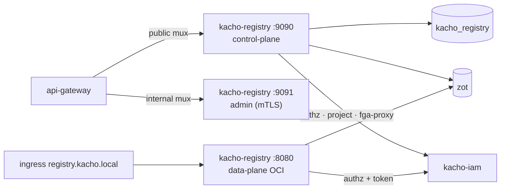

import CodeBlock from '@theme/CodeBlock'
import dedent from 'ts-dedent'

# Развёртывание

Эта страница описывает сборку Kachō Registry, применение миграций, три поверхности (control-plane
gRPC × 2 + data-plane OCI), связку с хранилищем zot и контейнерный образ. Ключи конфигурации
(ENV `KACHO_REGISTRY_*`) — на странице [Конфигурация](/install/configuration).

## Сборка

Две сборочные цели: API-сервер и отдельный бинарь миграций.

<CodeBlock language="bash">
  {dedent`
    # API-сервер → bin/kacho-registry
    make build

    # мигратор → bin/kacho-migrator
    make build-migrator
  `}
</CodeBlock>

Обе цели собирают статический бинарь (`CGO_ENABLED=0`).

## Миграции

Схема `kacho_registry` управляется goose-миграциями (встроены в бинарь через `embed.FS`): `0001_init`
создаёт `registries`, `registry_outbox` (transactional-outbox owner-tuple, с LISTEN/NOTIFY-триггером)
и `operations`; `0002` добавляет монотонность `source_version` в outbox. Образы и теги в БД **не**
хранятся. Применяются **отдельным** бинарём `bin/kacho-migrator` (не самим сервисом на старте).

<CodeBlock language="bash">
  {dedent`
    # применить все миграции
    KACHO_REGISTRY_DB_PASSWORD=secret bin/kacho-migrator up

    # статус
    KACHO_REGISTRY_DB_PASSWORD=secret bin/kacho-migrator status

    # откат последней
    KACHO_REGISTRY_DB_PASSWORD=secret bin/kacho-migrator down
  `}
</CodeBlock>

:::warning Применённую миграцию не редактировать
Изменение схемы — только новой миграцией; уже применённый файл не редактируется (конвенция Kachō).
После hard-cut/renumbering сверяйте **наличие объектов** каждой миграции (`to_regclass`, колонки,
constraints), а не только `max(version_id)`: goose может числить миграцию applied при отсутствующем
объекте.
:::

## Хранилище — zot

Registry не хранит блобы сам — их держит **zot** (OCI-совместимый registry-бэкенд, S3-backed).
Развёртывается рядом с сервисом; адрес задаётся `KACHO_REGISTRY_ZOT_ADDR` (cluster-internal HTTP). zot
**никогда** не выставляется наружу — доступ к образам идёт только через data-plane auth-proxy реестра.

## Запуск — три поверхности

<table>
  <thead><tr><th>Поверхность</th><th>Порт (дефолт)</th><th>Назначение</th></tr></thead>
  <tbody>
    <tr><td>public control-plane (gRPC)</td><td><code>:9090</code></td><td><code>RegistryService</code> / <code>OperationService</code></td></tr>
    <tr><td>internal control-plane (gRPC, mTLS)</td><td><code>:9091</code></td><td><code>InternalRegistryService</code> (GC, статистика) — cluster-internal</td></tr>
    <tr><td>data-plane (HTTP OCI)</td><td><code>:8080</code></td><td>Docker Registry v2 / OCI push/pull (<code>registry.kacho.local</code>)</td></tr>
  </tbody>
</table>

<CodeBlock language="bash">
  {dedent`
    KACHO_REGISTRY_DB_PASSWORD=secret \\
    KACHO_REGISTRY_ZOT_ADDR=http://zot.kacho.svc:5000 \\
    bin/kacho-registry serve
  `}
</CodeBlock>

Internal control-plane **не публикуется** на external endpoint — его REST-проекция в `api-gateway`
доступна только на cluster-internal mux. Data-plane выставляется наружу за внешней TLS-терминацией
(ingress host `registry.kacho.local`).

## Production-режим — fail-closed

В production сервис отказывается стартовать без секьюрной конфигурации:

- **Control-plane**: без breakglass — per-RPC authz `Check` (адрес IAM) **и** mTLS на **обоих**
  gRPC-listener'ах (`:9090`/`:9091`) обязательны, иначе процесс не поднимается.
- **Data-plane**: при `AUTH_MODE=production[-strict]` обязательны https-JWKS URL, pinned issuer и
  подтверждённая внешняя TLS-терминация — иначе старт отклоняется (bearer identity-JWT не должны
  транзитить открытым текстом).

## Контейнерный образ

Сервис собирается в контейнер:

<CodeBlock language="bash">
  {dedent`
    make docker      # docker build -t kacho-registry:dev .
  `}
</CodeBlock>

При развёртывании в кластер мигратор обычно запускается отдельным job/init-контейнером
(`kacho-migrator up`) до старта сервиса; сам сервис — Deployment с control-plane-портами и
отдельным data-plane-портом за ingress; zot — соседний Deployment/StatefulSet.

:::tip Дальше
Полный список ключей конфигурации, режимы `AUTH_MODE`, data-plane JWKS/issuer и per-edge mTLS —
[Конфигурация](/install/configuration). Первые запросы к запущенному сервису —
[Быстрый старт](/getting-started).
:::
