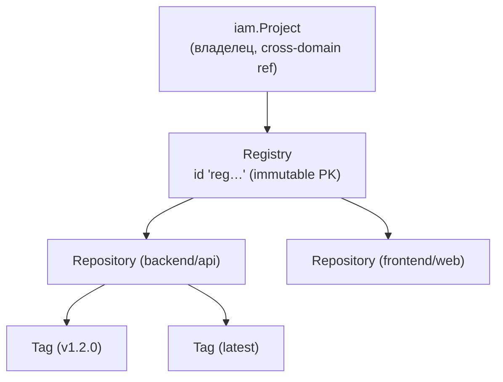
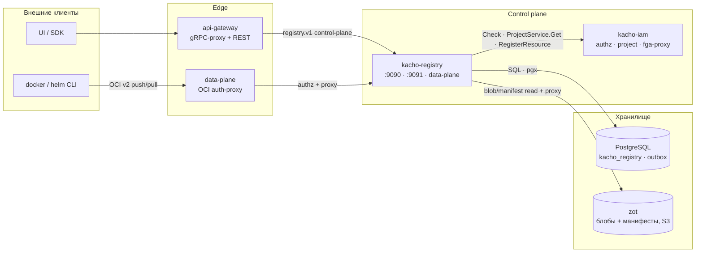

import hero from '@site/src/css/hero.module.css'

<header className={hero.hero}>
   Control-plane · Registry

  <h1 className={hero.title}>
    Реестр образов 
    Kachō
  </h1>

  

    Реестр контейнерных образов и OCI-артефактов платформы: <strong>namespace-реестры</strong> внутри
    проекта, авторизация push/pull через IAM, привычный <code>docker push</code> / <code>docker pull</code> и
    <code>helm push</code>. Control-plane метаданных на gRPC + REST, data-plane — стандартный
    OCI Distribution.
  

  

    <a className={hero.btnPrimary} href="/getting-started">Быстрый старт →</a>
    <a className={hero.btnGhost} href="/api/overview">Обзор API</a>
    <a className={hero.btnGhost} href="/architecture/overview">Архитектура</a>
    <a className={hero.btnGhost} href="https://github.com/PRO-Robotech/kacho-registry">GitHub</a>
  

</header>

## Что это и зачем

**Kachō Registry** — сервис хранения контейнерных образов и OCI-артефактов внутри платформы
Kachō. Пользователь заводит **Registry** — namespace-реестр в своём проекте — и работает с ним
стандартными инструментами: `docker login`, `docker push`, `docker pull`, `helm push`. Образы
адресуются как `registry.kacho.local/<registry-id>/<repo>:<tag>`.

Бизнес-ценность в том, что реестр **встроен в модель доступа платформы**. Не нужен внешний
registry со своей отдельной системой прав: кто может пушить и тянуть образы, определяют те же
роли IAM, что и для остального проекта. Каждый `docker push` / `docker pull` проходит per-request
проверку в IAM (ReBAC / OpenFGA) — доступ на уровне конкретного реестра и даже конкретного
репозитория внутри него. Метки реестра участвуют в label-scoped авторизации, как у любого
ресурса Kachō.

Registry — **тонкий namespace-слой над общим хранилищем блобов**: сами слои и манифесты живут в
бэкенде хранилища (zot), а kacho-registry владеет метаданными namespace и правилами доступа.
Образы и теги **не хранятся в БД** сервиса — это read-only проекция из хранилища.

:::info Две поверхности: control-plane и data-plane
Kachō Registry — это **два интерфейса** к одному namespace. **Control-plane** (gRPC + REST через
`api-gateway`) управляет реестрами и показывает содержимое: создать/переименовать/удалить Registry,
перечислить репозитории и теги. **Data-plane** (OCI Distribution / Docker Registry v2 на
`registry.kacho.local`) — это то, с чем работает `docker` / `helm`: push и pull блобов и манифестов.
:::

:::tip С чего начать
Новому читателю — [**Быстрый старт**](/getting-started): создать реестр через REST, залогиниться,
запушить и стянуть образ. Готовы к деталям — [Обзор API](/api/overview) и
[Архитектура](/architecture/overview).
:::

## Доменная модель

Kachō Registry оперирует **тремя типами ресурсов**. Все — «плоские» (flat): domain-поля на верхнем
уровне сообщения, без K8s-envelope. Registry — единственный ресурс, который сервис хранит в своей
БД; Repository и Tag — read-only проекции из хранилища образов (source of truth — zot).

<table>
  <thead>
    <tr><th>Ресурс</th><th>Назначение</th><th>Хранение</th></tr>
  </thead>
  <tbody>
    <tr><td><strong>Registry</strong></td><td>Namespace-реестр в проекте: имя, метки, endpoint, статус жизненного цикла. Единица владения и авторизации</td><td>БД kacho-registry (метаданные)</td></tr>
    <tr><td><strong>Repository</strong></td><td>OCI-репозиторий (образ) внутри namespace, напр. <code>backend/api</code>: число тегов, размер, тип артефакта</td><td>Проекция из zot (read-only)</td></tr>
    <tr><td><strong>Tag</strong></td><td>Тегированный образ (манифест): digest, размер, платформа, время создания, число скачиваний</td><td>Проекция из zot (read-only)</td></tr>
  </tbody>
</table>

:::note Идентификаторы реестра — серверные, читаемы по префиксу
Идентификатор Registry генерирует сервер (`kacho-corelib/ids`): 3-символьный префикс **`reg`** +
crockford-base32 (например, `reg7h9x2k4m8p0q1r5`). Тип ресурса читается по префиксу. Идентификатор
неизменяем (immutable PK) — смена имени реестра не затрагивает его id, endpoint и путь в хранилище.
Операции реестра (LRO) несут префикс **`rop`**.
:::

### Связи ресурсов

Registry принадлежит проекту IAM (`projectId` — cross-domain ссылка, TEXT, без FK). Внутри
namespace живут репозитории, в репозиториях — теги; и репозитории, и теги материализуются
хранилищем при `docker push` и читаются проекцией, а не хранятся в БД реестра.

## Как с сервисом общаться

Kachō Registry — доменный сервис платформы. По сборке он зависит только от `kacho-corelib` и
`kacho-proto`; в runtime у него исходящие рёбра в `kacho-iam` (авторизация, валидация проекта,
запись owner-tuple в FGA) и в бэкенд хранилища образов (zot). Tenant-запросы control-plane идут
через `api-gateway`; data-plane push/pull — на отдельный OCI-endpoint `registry.kacho.local`.

Система построена по принципу **database-per-service**: kacho-registry владеет схемой
`kacho_registry` и общается с другими доменами только по API (никаких cross-service FK). Реестр
хранит `projectId` как обычный текст и валидирует его через API kacho-iam на Create. Подробнее —
[Архитектура](/architecture/overview).

## Ключевые возможности

  

    🐳
    Стандартный OCI / Docker
    <code>docker push/pull</code> и <code>helm push</code> без спец-клиента: data-plane реализует Docker Registry v2 / OCI Distribution.
  

  

    🔑
    Авторизация через IAM
    Каждый push/pull проходит per-request Check в kacho-iam (ReBAC). Права — на уровне реестра и репозитория.
  

  

    ⇄
    gRPC + REST control-plane
    Единый контракт на Protocol Buffers (<code>kacho-proto</code>), REST-проекция через grpc-gateway.
  

  

    ▤
    Проекция из хранилища
    Репозитории и теги — read-only-проекция из zot (source of truth), не дублируются в БД реестра.
  

  

    ◨
    Docker и Helm рядом
    Реестр классифицирует тип артефакта (container / helm) по <code>config.mediaType</code> — фильтр «образы vs чарты».
  

  

    ⛓
    Owner-tuple через outbox
    При создании реестра owner-hierarchy-tuple пишется в FGA через транзакционный outbox (at-least-once).
  

## Технологический стек

<table>
  <thead><tr><th>Технология</th><th>Применение</th></tr></thead>
  <tbody>
    <tr><td>Go</td><td>Язык реализации (чистая архитектура: handler → use-case → domain)</td></tr>
    <tr><td>Protocol Buffers / Buf</td><td>Контракт control-plane API (<code>kacho-proto</code>, домен <code>kacho.cloud.registry.v1</code>)</td></tr>
    <tr><td>PostgreSQL / pgx v5</td><td>Хранилище метаданных namespace <code>kacho_registry</code></td></tr>
    <tr><td>zot</td><td>OCI-совместимый registry-бэкенд (блобы/манифесты, S3-backed) — source of truth образов</td></tr>
    <tr><td>OCI Distribution / Docker Registry v2</td><td>Data-plane push/pull (<code>registry.kacho.local</code>)</td></tr>
    <tr><td>Goose</td><td>Версионирование схемы (миграции <code>0001</code>, <code>0002</code>)</td></tr>
    <tr><td>OpenFGA (ReBAC) · Ory Hydra</td><td>Авторизация — per-RPC / per-request Check через kacho-iam; identity-JWT для data-plane</td></tr>
    <tr><td>grpc-gateway</td><td>REST-проекция control-plane gRPC</td></tr>
  </tbody>
</table>

## Структура репозиториев

<table>
  <thead><tr><th>Репозиторий</th><th>Назначение</th></tr></thead>
  <tbody>
    <tr><td><strong>kacho-registry</strong></td><td>Этот сервис: control-plane + data-plane реестра образов</td></tr>
    <tr><td><strong>kacho-proto</strong></td><td>Центральные <code>.proto</code> + сгенерированные Go-stubs (домен <code>kacho.cloud.registry.v1</code>)</td></tr>
    <tr><td><strong>kacho-corelib</strong></td><td>Общие пакеты (db, grpcsrv, grpcclient, config, ids, outbox, operations, ...)</td></tr>
    <tr><td><strong>kacho-api-gateway</strong></td><td>Edge: gRPC-proxy + REST mux control-plane</td></tr>
    <tr><td><strong>kacho-iam</strong></td><td>Авторизация (Check), валидация проекта (ProjectService.Get), fga-proxy (RegisterResource), token-shim</td></tr>
  </tbody>
</table>
